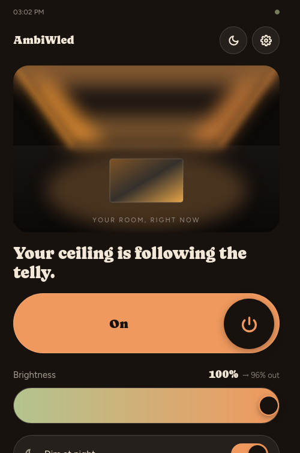
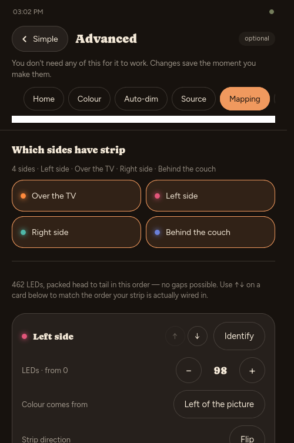
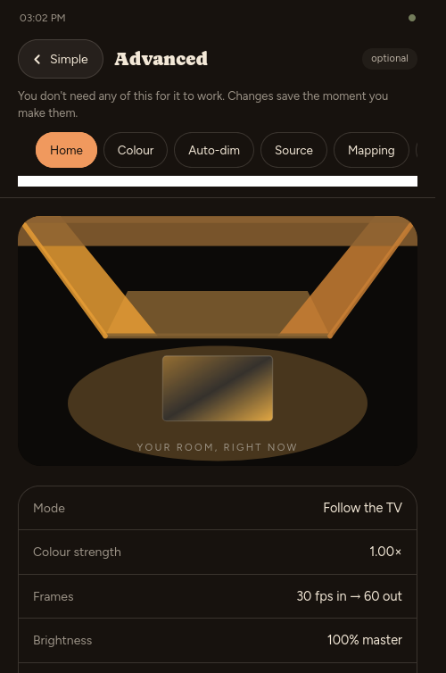
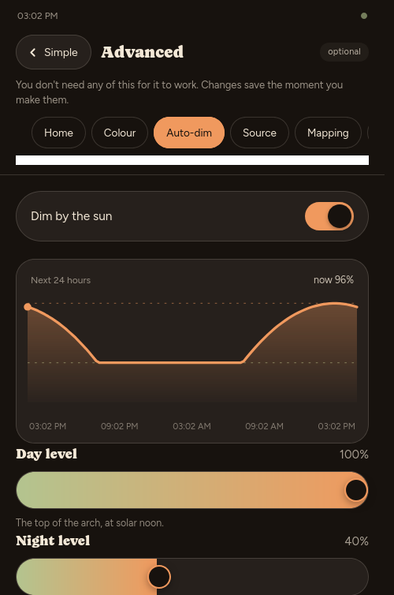
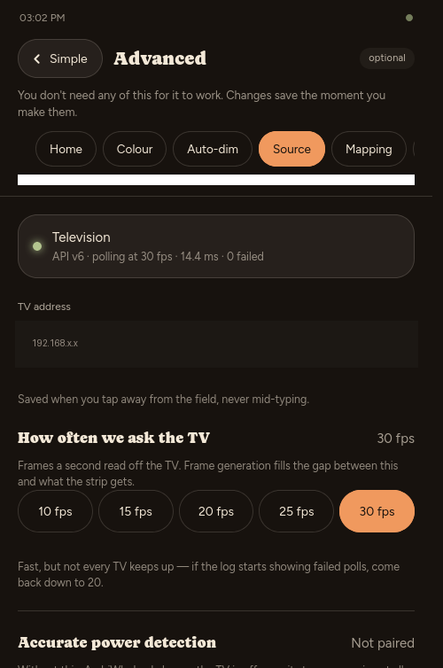

# AmbiWled

Streams Philips Ambilight colours from the TV onto an LED strip driven by
[WLED](https://kno.wled.ge/), at a higher and steadier frame rate than the TV
produces. Built for a strip mounted around a ceiling rectangle above the sofa,
but the mapping is data-driven and works for any perimeter layout.

<p align="center"></p>

```
Philips TV (JointSPACE)        AmbiWled                    WLED controller
  /6/ambilight/processed  ──►  poll → map → smooth → emit ──►  UDP DNRGB :21324
  HTTP, 10–45 fps              Docker container, 60 fps        any pixel count
                                     │
                                     ├── web UI (config + live preview)
                                     └── MQTT (Home Assistant, Node-RED)
```

## Why

Ambilight only lights the wall behind the TV. This puts the same colours on a
strip anywhere in the room — and because the TV's zone layout is read at
runtime rather than hardcoded, it adapts to whatever your set reports.

## What you need

- A Philips TV with the JointSPACE HTTP API (most 2015+ Android models)
- A WLED controller and an addressable strip
- Somewhere to run Docker, on the same network as both

## Quick start

The published image ([`iaakki/ambiwled`](https://hub.docker.com/r/iaakki/ambiwled)
on Docker Hub) is the fastest way to try it:

```bash
docker run -d -p 8080:8080 -v ambiwled_config:/config --name ambiwled iaakki/ambiwled
xdg-open http://localhost:8080
```

To build from source instead — or to use `./probe.py`/`./tools/corner_test.py`,
which aren't part of the image:

```bash
git clone https://github.com/iaakki/AmbiWLED.git && cd AmbiWLED

# Check the TV answers and see its zone layout
./probe.py <tv-ip>

docker compose up -d --build
xdg-open http://localhost:8080
```

Everything else is configured in the web UI, through a setup wizard on first
run. There is no save button: changes apply immediately, persist immediately,
and the field flashes green when they land.

The wizard walks through, in order: finding the TV, finding the controller,
which sides have strip and in what order, roughly where you are (for
auto-dim), and — recommended, not required — pairing with the TV for
accurate power detection (see below). Everything it asks can be changed again
later under **Advanced**.

## Mapping

The screen is hinged at its top edge and folded flat onto the ceiling: the top
of the picture lands on the run nearest the TV, the bottom on the run behind
you, and the sides stretch between them.

<p align="center"></p>

Edges are packed head-to-tail in the order shown, so each run's start pixel
is derived rather than typed — gaps and overlaps are not expressible. Set
each run's LED count and use ↑ ↓ to match the order the strip is actually
wired in, starting from the controller.

**Identify** lights one run for 10 seconds so you can see which is which. It
sends the pixel range explicitly, so it works on the row you are editing even
before the mapping validates.

Each edge also has its own **brightness** trim (0–2, default 1), applied after
the global level. The run behind the viewer usually wants less than the one
facing the TV.

Zone colours are placed at their centre positions and linearly interpolated,
never block-repeated. **Corner blending** (on by default) extends each edge with
a virtual zone from its neighbour, because the last zone of one screen edge and
the first of the next are the same physical corner.

The run with no source behind it — the one behind the viewer — is synthesised:
a gradient between the screen's two bottom corners by default, or a mirror of
another edge, a flat average, or off.

### Confirming the zone direction

The TV's index direction is worth verifying once:

```bash
./tools/corner_test.py --make            # writes corner-test.png
./tools/corner_test.py --check <tv-ip>   # reads the zones back and judges
```

Display the image full-screen with Ambilight on, then run `--check`. It reports
which way each side actually runs and what to change if it disagrees.

## Frame generation

The TV delivers hard steps at whatever rate it's polled (**Source** page,
default 20 fps — quick picks up to 30; not every set keeps up past 25).
Output runs on its own timer, independent of that rate (**Output** page,
default 60 fps): linear interpolation between the last two real samples,
timed against their own observed arrival interval rather than the
configured poll rate, so a slow or jittery TV doesn't cause overshoot.
Output fps has to be a whole multiple of the poll rate; setting them equal
is "no interpolation".

## Colour

Applied after mapping: **saturation → brightness → gamma → black floor**.

<p align="center"></p>

**Zone blending** controls how far each LED's colour is drawn from the TV's
own zones — low, each zone shows as a hard block exactly as the TV sends it;
high, it blends further across neighbouring zones for a softer look. Default
sits at the same point as before this was adjustable: a plain interpolation
between the two nearest zones.

Brightness is a *perceptual* level: the value is raised to ~2.2 before being
applied, so 0.5 looks half as bright rather than being half the PWM value.

Leave gamma at 1.0 unless you have turned WLED's own gamma off — applying it in
both places crushes the low end.

## Auto-dim by the sun

<p align="center"></p>

Sunrise and sunset are computed locally from your coordinates using the sunrise
equation. No external service, so it keeps working with the internet down, and
polar day and night are handled explicitly.

Brightness sits at **Night level** through the night, then follows a parabola
peaking at **Day level** at solar noon — brightest at midday, dimmest at dawn
and dusk, meeting Night level exactly at sunrise and sunset with no jump. No
schedule, no offsets — just those two levels and where you are.

Set your location with **Use my location** (browsers only expose geolocation
over https or localhost) or by pasting coordinates. The paste field accepts
`60.45, 22.27`, `60.45N 22.27E`, and Google or OpenStreetMap links.

## Detecting the TV turning off

<p align="center"></p>

Consecutive failed polls mean the TV is off — no separate integration needed,
the poll loop is the detector. Some Philips TVs complicate this: "Quick
Start" network standby keeps the JointSPACE API answering, and
`/ambilight/power` claiming "On", for a long grace period after the screen
actually goes dark — measured directly against real hardware, not assumed.
While that grace period lasts, AmbiWled has no way to tell a real black scene
from the TV having gone quietly dark.

Pairing (**Source** page, or offered in the setup wizard — recommended, not
required, since not every TV/firmware supports it) is a one-time JointSPACE
digest-auth handshake: enter the PIN the TV shows on screen, and AmbiWled
gets access to `/powerstate` and `/screenstate`, which stay truthful through
standby where `/ambilight/power` does not. Once paired, that answer overrides
the poll-based guess whenever they disagree; unpaired installs are
unaffected.

## Home Assistant and Node-RED

Enable MQTT and entities appear automatically via discovery — no YAML.

| Type | Entities |
|---|---|
| Switch | Ambilight on/off · Auto-dim by sun |
| Select | Mode (ambilight / preset / off) |
| Number | Brightness · Saturation · Black floor · Preset slot |
| Button | Identify, one per run |
| Sensor | TV state, source/output fps, TV latency, controller fps, strip draw, failed polls, active preset name |
| Binary sensor | Emitting · TV Ambilight · Controller reachable · Preset applied |

Topics: `<base>/state` (retained JSON), `<base>/set/<control>`, and
`<base>/status` for availability via a last-will message.

The broker password is never returned by the API — it reads as `********`, and
a UI round-trip cannot erase it.

### Add WLED to Home Assistant too

AmbiWled only ever exposes what it alone can know or do: whether it is
currently streaming, and its own diagnostics. It deliberately does not try to
be a general WLED remote — **add your controller to Home Assistant directly**
(Settings → Devices & Services → Add Integration → WLED) for the fixture's own
controls: power, brightness, colour, and a preset picker with real names. That
integration talks to the controller directly and already does this well.

A typical "party mode" automation then needs both:

1. Turn AmbiWled's **Ambilight** switch off (stop streaming)
2. Call WLED's own preset `select` entity

The **Mode / Preset** entities AmbiWled itself publishes exist for the case
where you have *not* added WLED to Home Assistant separately — a minimal setup
where AmbiWled is the only integration point. If you have the native
integration, prefer it; its preset list has names, AmbiWled's is a bare
number.

## WLED setup

| Setting | Value | Why |
|---|---|---|
| Auto-calculate white | **Accurate** | AmbiWled streams RGB; WLED derives W |
| Crossfade / transition | **0 ms** | AmbiWled already smooths; two stages is mush |
| Realtime LED offset | **0** | Or the stream lands on the wrong pixels |
| Realtime segment | **entire strip** | Confines the stream if set to one segment |
| Boot preset | your idle look | What the ceiling returns to when the TV is off |

AmbiWled sends timeout byte `2`, so two seconds after the TV goes off WLED
returns to its own state by itself. When the TV is off the bridge **stops
sending** rather than sending black — letting the timeout expire is what
triggers the fallback.

### Segment layouts

The **Output** panel can write the segment layout for you, derived from your
edge configuration:

- **Front → back** — one mirrored segment whose offset is the middle of the
  front run, so a single effect starts at the front centre and curls down both
  sides to meet at the rear, in phase, with no restart at the corners.
- **One per edge** — a segment per run, each with its own effect.

Optionally saved as a WLED preset so it survives a power cut.

> Segments live in presets, not in WLED's config: every preset carries its own
> copy, including mirror and offset. If one preset lacks them, selecting it
> resets your layout.

## Container health

The image includes a `HEALTHCHECK` that calls the running service's own
`/api/state`, so `docker ps` and any orchestrator report real health rather
than just "the process is running". It reads the configured port from
`config.json` if present, so it keeps working if you change it.

## Tests

```bash
make install    # venv + dev dependencies
make test       # no TV or controller needed; both are faked
```

## Configuration

A single JSON file at `/config/config.json`, mounted from `./config`. See
`config/config.example.json`. The UI validates every change and rejects the
whole update if edges overlap, leave a gap, or do not total the LED count.

## HTTP API

| Method | Path | Purpose |
|---|---|---|
| GET | `/api/state` | metrics, config, detected layout, validation |
| GET | `/api/config` | current config (secrets redacted) |
| PUT | `/api/config` | full config or partial patch; validates and applies live |
| POST | `/api/config/validate` | dry run |
| POST | `/api/config/reset` | back to defaults |
| POST | `/api/config/import` | replace the whole config; rejects on schema-version mismatch |
| POST | `/api/wled/segments` | write the segment layout (`?mode=edges\|front_to_back`) |
| POST | `/api/mqtt/test` | try logging in to a broker; distinguishes unreachable from rejected credentials |
| POST | `/api/tv/pair/start` | begin TV pairing — the TV shows a PIN |
| POST | `/api/tv/pair/confirm` | finish pairing with that PIN |
| WS | `/ws` | binary pixel frames, JSON metrics, identify commands |

## Troubleshooting

| Symptom | Check |
|---|---|
| "set a TV address" | The Source panel is empty; enter the TV's IP |
| "TV off" but the TV is on | Is Ambilight enabled on the TV? Try `./probe.py <tv-ip>` |
| Streaming, but the strip is dark | Controller reachable? Check the Output panel telemetry |
| Colours lag or smear | WLED's crossfade is not 0 |
| Dark scenes crushed | Gamma set in both AmbiWled and WLED |
| A run flows the wrong way | Use **Identify**, then **Flip** that edge's strip direction |
| Effects start at the wrong corner | Push the front → back segment layout |
| Strip stays on a while after the TV turns off | Pair with the TV (see above) — some sets keep answering as "on" for minutes after the screen goes dark |

## Licence

GPL-3.0-or-later. See [LICENSE](LICENSE).

Copyright (C) 2026 Jaska Kąngasvíerì
